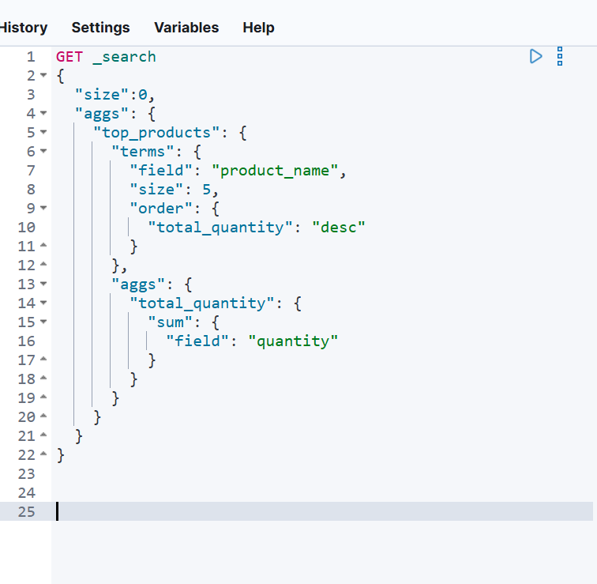
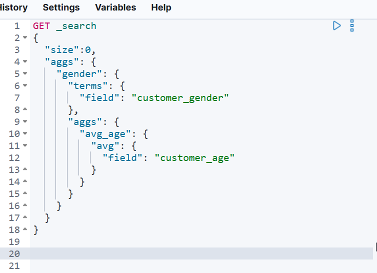
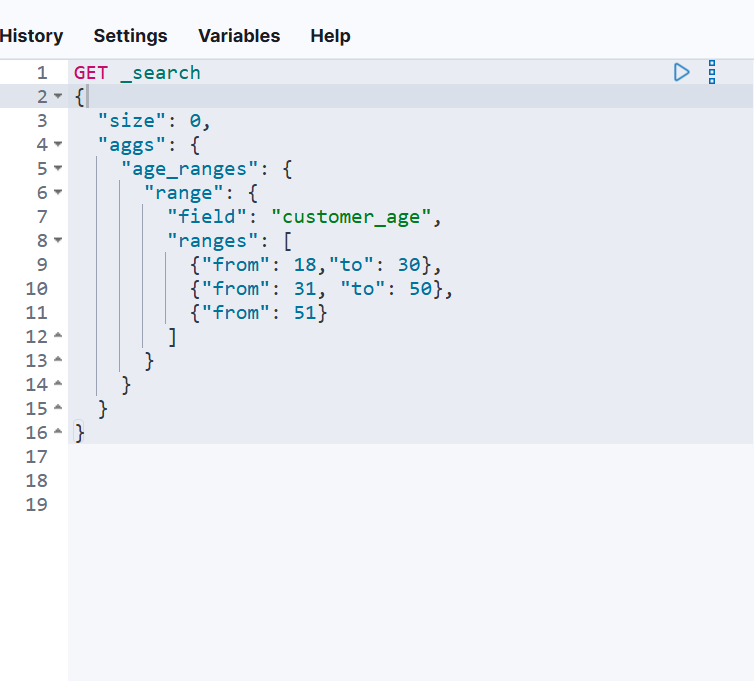

# Kibana操作

> 学院：省级示范性软件学院
> 课程：高级数据库技术与应用
> 题目：《 实验五：Kibana操作》
> 姓名：满家荣
> 学号：2200770216	
> 班级：软工2205
> 日期：2024-11-11
> 实验环境： Kibana,elasticsearch

## 一、实验目的

练习Kibana

 

 

## 二、实验内容

1. 使用Kibana完成[实验三 聚合操作](https://www.yuque.com/u369937/wskurb/nizzczly3ahu08t9)的 10道题
2. 制作仪表盘

## 三、问题及解决办法

####  使用Kibana完成聚合查询

> 1. 统计每个产品类别的总销售额。

~~~json
{
  "took": 3,
  "timed_out": false,
  "_shards": {
    "total": 21,
    "successful": 21,
    "skipped": 0,
    "failed": 0
  },
  "hits": {
    "total": {
      "value": 3181,
      "relation": "eq"
    },
    "max_score": null,
    "hits": []
  },
  "aggregations": {
    "categories": {
      "doc_count_error_upper_bound": 0,
      "sum_other_doc_count": 0,
      "buckets": [
        {
          "key": "Jewelry",
          "doc_count": 14,
          "sumGMV": {
            "value": 17477.37028503418
          }
        },
        {
          "key": "Electronics",
          "doc_count": 13,
          "sumGMV": {
            "value": 18941.559997558594
          }
        },
        {
          "key": "Home Appliances",
          "doc_count": 13,
          "sumGMV": {
            "value": 25865.190231323242
          }
        },
        {
          "key": "Beauty",
          "doc_count": 11,
          "sumGMV": {
            "value": 22708.94012451172
          }
        },
        {
          "key": "Furniture",
          "doc_count": 10,
          "sumGMV": {
            "value": 17228.31996154785
          }
        },
        {
          "key": "Books",
          "doc_count": 9,
          "sumGMV": {
            "value": 11878.820098876953
          }
        },
        {
          "key": "Groceries",
          "doc_count": 9,
          "sumGMV": {
            "value": 16172.980072021484
          }
        },
        {
          "key": "Fashion",
          "doc_count": 8,
          "sumGMV": {
            "value": 7073.110048294067
          }
        },
        {
          "key": "Toys",
          "doc_count": 7,
          "sumGMV": {
            "value": 10528.830047607422
          }
        },
        {
          "key": "Sports",
          "doc_count": 6,
          "sumGMV": {
            "value": 13250.500122070312
          }
        }
      ]
    }
  }
}
~~~

>    2.计算每个城市的平均订单金额。

~~~json
{
  "took": 2,
  "timed_out": false,
  "_shards": {
    "total": 21,
    "successful": 21,
    "skipped": 0,
    "failed": 0
  },
  "hits": {
    "total": {
      "value": 3181,
      "relation": "eq"
    },
    "max_score": null,
    "hits": []
  },
  "aggregations": {
    "categories": {
      "doc_count_error_upper_bound": 0,
      "sum_other_doc_count": 0,
      "buckets": [
        {
          "key": "Los Angeles",
          "doc_count": 13,
          "avgOrder": {
            "value": 1482.7977142333984
          }
        },
        {
          "key": "San Diego",
          "doc_count": 13,
          "avgOrder": {
            "value": 1878.4761915940505
          }
        },
        {
          "key": "San Jose",
          "doc_count": 12,
          "avgOrder": {
            "value": 1587.2216771443684
          }
        },
        {
          "key": "Philadelphia",
          "doc_count": 11,
          "avgOrder": {
            "value": 1370.19365345348
          }
        },
        {
          "key": "New York",
          "doc_count": 10,
          "avgOrder": {
            "value": 1801.9510040283203
          }
        },
        {
          "key": "Chicago",
          "doc_count": 9,
          "avgOrder": {
            "value": 1062.1610989040798
          }
        },
        {
          "key": "Houston",
          "doc_count": 9,
          "avgOrder": {
            "value": 1735.199978298611
          }
        },
        {
          "key": "Dallas",
          "doc_count": 8,
          "avgOrder": {
            "value": 1291.8024978637695
          }
        },
        {
          "key": "Phoenix",
          "doc_count": 8,
          "avgOrder": {
            "value": 2315.7625274658203
          }
        },
        {
          "key": "San Antonio",
          "doc_count": 7,
          "avgOrder": {
            "value": 1607.7128516605922
          }
        }
      ]
    }
  }
}
~~~

>    3.找出销量最高的前5个产品。

~~~json
{
  "took": 7,
  "timed_out": false,
  "_shards": {
    "total": 21,
    "successful": 21,
    "skipped": 0,
    "failed": 0
  },
  "hits": {
    "total": {
      "value": 3181,
      "relation": "eq"
    },
    "max_score": null,
    "hits": []
  },
  "aggregations": {
    "top_products": {
      "doc_count_error_upper_bound": -1,
      "sum_other_doc_count": 67,
      "buckets": [
        {
          "key": "Elite Accessory",
          "doc_count": 6,
          "total_quantity": {
            "value": 25
          }
        },
        {
          "key": "Ultra Device",
          "doc_count": 7,
          "total_quantity": {
            "value": 24
          }
        },
        {
          "key": "Ultra Accessory",
          "doc_count": 8,
          "total_quantity": {
            "value": 22
          }
        },
        {
          "key": "Ultra Gadget",
          "doc_count": 6,
          "total_quantity": {
            "value": 21
          }
        },
        {
          "key": "Ultra Tool",
          "doc_count": 6,
          "total_quantity": {
            "value": 21
          }
        }
      ]
    }
  }
}
~~~

>    4.计算男性和女性客户的平均年龄。

~~~json
{
  "took": 2,
  "timed_out": false,
  "_shards": {
    "total": 21,
    "successful": 21,
    "skipped": 0,
    "failed": 0
  },
  "hits": {
    "total": {
      "value": 3181,
      "relation": "eq"
    },
    "max_score": null,
    "hits": []
  },
  "aggregations": {
    "gender": {
      "doc_count_error_upper_bound": 0,
      "sum_other_doc_count": 0,
      "buckets": [
        {
          "key": "male",
          "doc_count": 55,
          "avg_age": {
            "value": 45.61818181818182
          }
        },
        {
          "key": "female",
          "doc_count": 45,
          "avg_age": {
            "value": 43.888888888888886
          }
        }
      ]
    }
  }
}
~~~

>    5.统计每种支付方式的使用次数和总金额。

~~~json
{
  "took": 3,
  "timed_out": false,
  "_shards": {
    "total": 21,
    "successful": 21,
    "skipped": 0,
    "failed": 0
  },
  "hits": {
    "total": {
      "value": 3181,
      "relation": "eq"
    },
    "max_score": null,
    "hits": []
  },
  "aggregations": {
    "pay_method": {
      "doc_count_error_upper_bound": 0,
      "sum_other_doc_count": 0,
      "buckets": [
        {
          "key": "Cash on Delivery",
          "doc_count": 29,
          "total_amount": {
            "value": 38746.55044555664
          }
        },
        {
          "key": "Debit Card",
          "doc_count": 29,
          "total_amount": {
            "value": 48975.19040107727
          }
        },
        {
          "key": "Credit Card",
          "doc_count": 22,
          "total_amount": {
            "value": 36358.470153808594
          }
        },
        {
          "key": "PayPal",
          "doc_count": 20,
          "total_amount": {
            "value": 37045.40998840332
          }
        },
        {
          "key": "credit_card",
          "doc_count": 8,
          "total_amount": {
            "value": 1216
          }
        },
        {
          "key": "bank_transfer",
          "doc_count": 4,
          "total_amount": {
            "value": 705
          }
        },
        {
          "key": "debit_card",
          "doc_count": 4,
          "total_amount": {
            "value": 510
          }
        },
        {
          "key": "paypal",
          "doc_count": 4,
          "total_amount": {
            "value": 271.97
          }
        }
      ]
    }
  }
}
~~~

>    6.计算每月的总销售额。

~~~json
{
  "took": 7,
  "timed_out": false,
  "_shards": {
    "total": 21,
    "successful": 21,
    "skipped": 0,
    "failed": 0
  },
  "hits": {
    "total": {
      "value": 3181,
      "relation": "eq"
    },
    "max_score": null,
    "hits": []
  },
  "aggregations": {
    "month_sales": {
      "buckets": [
        {
          "key_as_string": "2023-01-01T00:00:00.000Z",
          "key": 1672531200000,
          "doc_count": 12,
          "total_amount": {
            "value": 24381.61993408203
          }
        },
        {
          "key_as_string": "2023-02-01T00:00:00.000Z",
          "key": 1675209600000,
          "doc_count": 11,
          "total_amount": {
            "value": 18870.850006103516
          }
        },
        {
          "key_as_string": "2023-03-01T00:00:00.000Z",
          "key": 1677628800000,
          "doc_count": 10,
          "total_amount": {
            "value": 17959.33026123047
          }
        },
        {
          "key_as_string": "2023-04-01T00:00:00.000Z",
          "key": 1680307200000,
          "doc_count": 9,
          "total_amount": {
            "value": 18775.959869384766
          }
        },
        {
          "key_as_string": "2023-05-01T00:00:00.000Z",
          "key": 1682899200000,
          "doc_count": 10,
          "total_amount": {
            "value": 11713.169967651367
          }
        },
        {
          "key_as_string": "2023-06-01T00:00:00.000Z",
          "key": 1685577600000,
          "doc_count": 9,
          "total_amount": {
            "value": 6771.1600341796875
          }
        },
        {
          "key_as_string": "2023-07-01T00:00:00.000Z",
          "key": 1688169600000,
          "doc_count": 7,
          "total_amount": {
            "value": 9110.010131835938
          }
        },
        {
          "key_as_string": "2023-08-01T00:00:00.000Z",
          "key": 1690848000000,
          "doc_count": 8,
          "total_amount": {
            "value": 12135.870210647583
          }
        },
        {
          "key_as_string": "2023-09-01T00:00:00.000Z",
          "key": 1693526400000,
          "doc_count": 3,
          "total_amount": {
            "value": 8615.500122070312
          }
        },
        {
          "key_as_string": "2023-10-01T00:00:00.000Z",
          "key": 1696118400000,
          "doc_count": 6,
          "total_amount": {
            "value": 12106.000183105469
          }
        },
        {
          "key_as_string": "2023-11-01T00:00:00.000Z",
          "key": 1698796800000,
          "doc_count": 6,
          "total_amount": {
            "value": 8176.529968261719
          }
        },
        {
          "key_as_string": "2023-12-01T00:00:00.000Z",
          "key": 1701388800000,
          "doc_count": 9,
          "total_amount": {
            "value": 12509.620300292969
          }
        },
        {
          "key_as_string": "2024-01-01T00:00:00.000Z",
          "key": 1704067200000,
          "doc_count": 4,
          "total_amount": {
            "value": 436.24
          }
        },
        {
          "key_as_string": "2024-02-01T00:00:00.000Z",
          "key": 1706745600000,
          "doc_count": 6,
          "total_amount": {
            "value": 845.74
          }
        },
        {
          "key_as_string": "2024-03-01T00:00:00.000Z",
          "key": 1709251200000,
          "doc_count": 7,
          "total_amount": {
            "value": 920.99
          }
        },
        {
          "key_as_string": "2024-04-01T00:00:00.000Z",
          "key": 1711929600000,
          "doc_count": 3,
          "total_amount": {
            "value": 500
          }
        }
      ]
    }
  }
}
~~~

>  7.找出平均订单金额最高的前3个客户。

~~~json
{
  "took": 2,
  "timed_out": false,
  "_shards": {
    "total": 21,
    "successful": 21,
    "skipped": 0,
    "failed": 0
  },
  "hits": {
    "total": {
      "value": 3181,
      "relation": "eq"
    },
    "max_score": null,
    "hits": []
  },
  "aggregations": {
    "top_customers": {
      "doc_count_error_upper_bound": -1,
      "sum_other_doc_count": 93,
      "buckets": [
        {
          "key": "Eva Rodriguez",
          "doc_count": 1,
          "avg_amount": {
            "value": 3557.199951171875
          }
        },
        {
          "key": "Charlie Rodriguez",
          "doc_count": 2,
          "avg_amount": {
            "value": 3538.47509765625
          }
        },
        {
          "key": "Grace Martinez",
          "doc_count": 4,
          "avg_amount": {
            "value": 3227.345085144043
          }
        }
      ]
    }
  }
}
~~~

>    8.计算每个年龄段（18-30，31-50，51+）的客户数量。

~~~json
{
  "took": 3,
  "timed_out": false,
  "_shards": {
    "total": 21,
    "successful": 21,
    "skipped": 0,
    "failed": 0
  },
  "hits": {
    "total": {
      "value": 3181,
      "relation": "eq"
    },
    "max_score": null,
    "hits": []
  },
  "aggregations": {
    "age_ranges": {
      "buckets": [
        {
          "key": "18.0-30.0",
          "from": 18,
          "to": 30,
          "doc_count": 24
        },
        {
          "key": "31.0-50.0",
          "from": 31,
          "to": 50,
          "doc_count": 31
        },
        {
          "key": "51.0-*",
          "from": 51,
          "doc_count": 42
        }
      ]
    }
  }
}
~~~

>    9.计算每个产品类别的平均单价。

~~~json
{
  "took": 2,
  "timed_out": false,
  "_shards": {
    "total": 21,
    "successful": 21,
    "skipped": 0,
    "failed": 0
  },
  "hits": {
    "total": {
      "value": 3181,
      "relation": "eq"
    },
    "max_score": null,
    "hits": []
  },
  "aggregations": {
    "category": {
      "doc_count_error_upper_bound": 0,
      "sum_other_doc_count": 0,
      "buckets": [
        {
          "key": "Jewelry",
          "doc_count": 14,
          "avg_price": {
            "value": 537.6807218279157
          }
        },
        {
          "key": "Electronics",
          "doc_count": 13,
          "avg_price": {
            "value": 484.44461763822113
          }
        },
        {
          "key": "Home Appliances",
          "doc_count": 13,
          "avg_price": {
            "value": 645.6961549612192
          }
        },
        {
          "key": "Beauty",
          "doc_count": 11,
          "avg_price": {
            "value": 701.0781749378551
          }
        },
        {
          "key": "Furniture",
          "doc_count": 10,
          "avg_price": {
            "value": 518.5519981384277
          }
        },
        {
          "key": "Books",
          "doc_count": 9,
          "avg_price": {
            "value": 524.0977762010363
          }
        },
        {
          "key": "Groceries",
          "doc_count": 9,
          "avg_price": {
            "value": 566.4644444783529
          }
        },
        {
          "key": "Fashion",
          "doc_count": 8,
          "avg_price": {
            "value": 369.4774992465973
          }
        },
        {
          "key": "Toys",
          "doc_count": 7,
          "avg_price": {
            "value": 485.97999899727955
          }
        },
        {
          "key": "Sports",
          "doc_count": 6,
          "avg_price": {
            "value": 483.9566599527995
          }
        }
      ]
    }
  }
}
~~~

>    10.找出订单数量最多的前5个城市。

~~~json
{
  "took": 3,
  "timed_out": false,
  "_shards": {
    "total": 21,
    "successful": 21,
    "skipped": 0,
    "failed": 0
  },
  "hits": {
    "total": {
      "value": 3181,
      "relation": "eq"
    },
    "max_score": null,
    "hits": []
  },
  "aggregations": {
    "top_cities": {
      "doc_count_error_upper_bound": 0,
      "sum_other_doc_count": 42,
      "buckets": [
        {
          "key": "San Jose",
          "doc_count": 12,
          "sum_quantity": {
            "value": 48
          }
        },
        {
          "key": "Los Angeles",
          "doc_count": 13,
          "sum_quantity": {
            "value": 39
          }
        },
        {
          "key": "San Diego",
          "doc_count": 13,
          "sum_quantity": {
            "value": 38
          }
        },
        {
          "key": "Philadelphia",
          "doc_count": 11,
          "sum_quantity": {
            "value": 30
          }
        },
        {
          "key": "Chicago",
          "doc_count": 9,
          "sum_quantity": {
            "value": 29
          }
        }
      ]
    }
  }
}
~~~

####   制作仪表盘

控件筛选：

**（男性客户，产品类别为Home Appliances, 城市为San Jose 的数据）**

