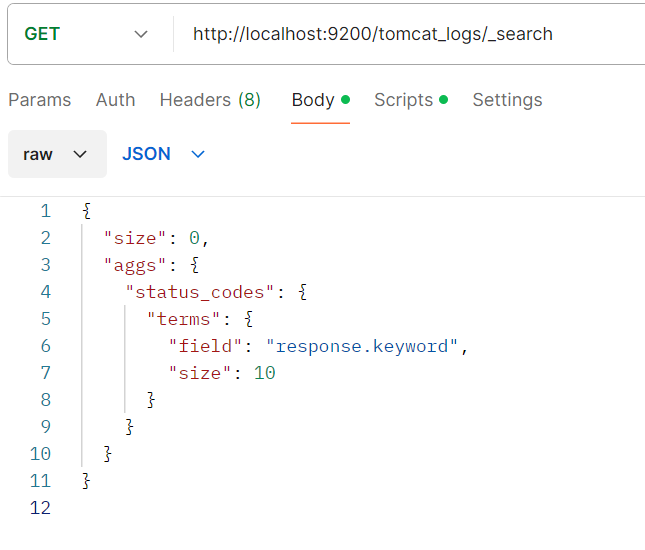

# **实验四 Logstash操作**

> 学院：省级示范性软件学院
> 课程：高级数据库技术与应用
> 题目：《 实验四：实验四 Logstash操作》
> 姓名：满家荣
> 学号：2200770216
> 班级：软工2205
> 日期：2024-11-9
> 实验环境： postman，elasticsearch

## 一、实验目的

练习Logstash 操作

## 二、实验内容

### 1.1. tomcat日志处理

**要求：**

1. 将tomcat的logs中的localhost_access_log访问日志导入到本地的elasticsearch中。
2. 数据导入到一个名为tomcat_logs的索引。
3. 在elasticsearch中做5个日志相关的分析，题目自拟。（提示：可以参考第04章聚合操作日志实战内容）

### 1.2. 数据转换和传输

**要求：**

1. 将本地的mysql数据库中的一张表导入到本地的elasticsearch中。
2. 数据库表更新后，数据能够自动同步到elasticsearch中。

## 三、问题及解决办法

### 一、tomcat日志处理

#### **创建tomcat_logs索引**

~~~
PUT http://localhost:9200/tomcat_logs
~~~

#### **配置tomcat_logs.conf**

~~~
input {
  file {
    path => "D:/logstash-8.15.0-windows-x86_64/tomcat_logs/*.txt"
  # 从文件开始位置读取
    start_position => "beginning"
    sincedb_path => "NUL"  
  }
}

filter {
    grok {
        match => { "message" => "%{IPORHOST:client_ip} - - \[%{HTTPDATE:timestamp}\] \"%{WORD:method} %{URIPATHPARAM:request} HTTP/%{NUMBER:http_version}\" %{NUMBER:response} %{NUMBER:bytes}" }
    }
date {
    match => ["timestamp", "dd/MMM/yyyy:HH:mm:ss Z"]
    target => "@timestamp"
  }
}

output {
  elasticsearch {
    hosts => ["http://localhost:9200"]  # Elasticsearch 地址
    index => "tomcat_logs"  # 索引名称
  }
  stdout { codec => rubydebug }  # 输出到控制台，便于调试
}

~~~

conf配置必须正确，否则数据无法导入

#### **运行Logstash**

~~~bash
.\bin\logstash.bat -f .\config\tomcat_logs.conf
~~~

运行终端数据如下（部分）：

~~~bash
    "http_version" => "1.1",
        "response" => "404",
         "request" => "/products/item/123",
          "method" => "GET",
      "@timestamp" => 2024-08-29T03:12:31.000Z,
           "bytes" => "1231",
         "message" => "0:0:0:0:0:0:0:1 - - [29/Aug/2024:11:12:31 +0800] \"GET /products/item/123 HTTP/1.1\" 404 1231\r",
       "client_ip" => "0:0:0:0:0:0:0:1",
             "log" => {
        "file" => {
            "path" => "D:/logstash-8.15.0-windows-x86_64/tomcat_logs/localhost_access_log.2024-09-25.txt"
        }
    },
            "host" => {
        "name" => "LAPTOP-P44CCG81"
    },
       "timestamp" => "29/Aug/2024:11:12:31 +0800",
        "@version" => "1"
}
{
           "event" => {
        "original" => "0:0:0:0:0:0:0:1 - - [09/Sep/2024:11:12:31 +0800] \"POST /examples/jsp/images/return.gif HTTP/1.1\" 500 0\r"
    },
    "http_version" => "1.1",
        "response" => "500",
         "request" => "/examples/jsp/images/return.gif",
          "method" => "POST",
      "@timestamp" => 2024-09-09T03:12:31.000Z,
           "bytes" => "0",
         "message" => "0:0:0:0:0:0:0:1 - - [09/Sep/2024:11:12:31 +0800] \"POST /examples/jsp/images/return.gif HTTP/1.1\" 500 0\r",
       "client_ip" => "0:0:0:0:0:0:0:1",
             "log" => {
        "file" => {
            "path" => "D:/logstash-8.15.0-windows-x86_64/tomcat_logs/localhost_access_log.2024-09-25.txt"
        }
    },
            "host" => {
        "name" => "LAPTOP-P44CCG81"
    },
       "timestamp" => "09/Sep/2024:11:12:31 +0800",
        "@version" => "1"
}
{
           "event" => {
        "original" => "0:0:0:0:0:0:0:1 - - [04/Sep/2024:11:12:31 +0800] \"POST /about HTTP/1.1\" 500 1231\r"
    },
    "http_version" => "1.1",
        "response" => "500",
         "request" => "/about",
          "method" => "POST",
      "@timestamp" => 2024-09-04T03:12:31.000Z,
           "bytes" => "1231",
         "message" => "0:0:0:0:0:0:0:1 - - [04/Sep/2024:11:12:31 +0800] \"POST /about HTTP/1.1\" 500 1231\r",
       "client_ip" => "0:0:0:0:0:0:0:1",
             "log" => {
        "file" => {
            "path" => "D:/logstash-8.15.0-windows-x86_64/tomcat_logs/localhost_access_log.2024-09-25.txt"
        }
    },
            "host" => {
        "name" => "LAPTOP-P44CCG81"
    },
       "timestamp" => "04/Sep/2024:11:12:31 +0800",
        "@version" => "1"
}
{
           "event" => {
        "original" => "0:0:0:0:0:0:0:1 - - [13/Sep/2024:11:12:31 +0800] \"POST /api/products/list HTTP/1.1\" 500 1242\r"
    },
    "http_version" => "1.1",
        "response" => "500",
         "request" => "/api/products/list",
          "method" => "POST",
      "@timestamp" => 2024-09-13T03:12:31.000Z,
           "bytes" => "1242",
         "message" => "0:0:0:0:0:0:0:1 - - [13/Sep/2024:11:12:31 +0800] \"POST /api/products/list HTTP/1.1\" 500 1242\r",
       "client_ip" => "0:0:0:0:0:0:0:1",
             "log" => {
        "file" => {
            "path" => "D:/logstash-8.15.0-windows-x86_64/tomcat_logs/localhost_access_log.2024-09-25.txt"
        }
    },
            "host" => {
        "name" => "LAPTOP-P44CCG81"
    },
       "timestamp" => "13/Sep/2024:11:12:31 +0800",
        "@version" => "1"
}
~~~

#### **查询是否成功导入**

~~~
GET http://localhost:9200/tomcat_logs/_search
~~~

~~~json
{
    "took": 2,
    "timed_out": false,
    "_shards": {
        "total": 1,
        "successful": 1,
        "skipped": 0,
        "failed": 0
    },
    "hits": {
        "total": {
            "value": 3000,
            "relation": "eq"
        },
        "max_score": 1.0,
        "hits": [
            {
                "_index": "tomcat_logs",
                "_id": "7jUrEJMBPpl18r9mgCuP",
                "_score": 1.0,
                "_source": {
                    "event": {
                        "original": "0:0:0:0:0:0:0:1 - - [27/Sep/2024:11:12:31 +0800] \"GET /demo/hello HTTP/1.1\" 500 1231\r"
                    },
                    "http_version": "1.1",
                    "response": "500",
                    "request": "/demo/hello",
                    "method": "GET",
                    "@timestamp": "2024-09-27T03:12:31.000Z",
                    "bytes": "1231",
                    "message": "0:0:0:0:0:0:0:1 - - [27/Sep/2024:11:12:31 +0800] \"GET /demo/hello HTTP/1.1\" 500 1231\r",
                    "client_ip": "0:0:0:0:0:0:0:1",
                    "log": {
                        "file": {
                            "path": "D:/logstash-8.15.0-windows-x86_64/tomcat_logs/localhost_access_log.2024-10-21.txt"
                        }
                    },
                    "host": {
                        "name": "LAPTOP-P44CCG81"
                    },
                    "timestamp": "27/Sep/2024:11:12:31 +0800",
                    "@version": "1"
                }
            },
            {
                "_index": "tomcat_logs",
                "_id": "uTUrEJMBPpl18r9mgCuN",
                "_score": 1.0,
                "_source": {
                    "event": {
                        "original": "0:0:0:0:0:0:0:1 - - [09/Oct/2024:11:12:31 +0800] \"POST /demo1/ HTTP/1.1\" 200 1242\r"
                    },
                    "http_version": "1.1",
                    "response": "200",
                    "request": "/demo1/",
                    "method": "POST",
                    "@timestamp": "2024-10-09T03:12:31.000Z",
                    "bytes": "1242",
                    "message": "0:0:0:0:0:0:0:1 - - [09/Oct/2024:11:12:31 +0800] \"POST /demo1/ HTTP/1.1\" 200 1242\r",
                    "client_ip": "0:0:0:0:0:0:0:1",
                    "log": {
                        "file": {
                            "path": "D:/logstash-8.15.0-windows-x86_64/tomcat_logs/localhost_access_log.2024-10-21.txt"
                        }
                    },
                    "host": {
                        "name": "LAPTOP-P44CCG81"
                    },
                    "timestamp": "09/Oct/2024:11:12:31 +0800",
                    "@version": "1"
                }
            },
            {
                "_index": "tomcat_logs",
                "_id": "zTUrEJMBPpl18r9mgCuP",
                "_score": 1.0,
                "_source": {
                    "event": {
                        "original": "0:0:0:0:0:0:0:1 - - [02/Oct/2024:11:12:31 +0800] \"POST /examples/jsp/images/code.gif HTTP/1.1\" 200 292\r"
                    },
                    "http_version": "1.1",
                    "response": "200",
                    "request": "/examples/jsp/images/code.gif",
                    "method": "POST",
                    "@timestamp": "2024-10-02T03:12:31.000Z",
                    "bytes": "292",
                    "message": "0:0:0:0:0:0:0:1 - - [02/Oct/2024:11:12:31 +0800] \"POST /examples/jsp/images/code.gif HTTP/1.1\" 200 292\r",
                    "client_ip": "0:0:0:0:0:0:0:1",
                    "log": {
                        "file": {
                            "path": "D:/logstash-8.15.0-windows-x86_64/tomcat_logs/localhost_access_log.2024-10-21.txt"
                        }
                    },
                    "host": {
                        "name": "LAPTOP-P44CCG81"
                    },
                    "timestamp": "02/Oct/2024:11:12:31 +0800",
                    "@version": "1"
                }
            },
            {
                "_index": "tomcat_logs",
                "_id": "0DUrEJMBPpl18r9mgCuP",
                "_score": 1.0,
                "_source": {
                    "event": {
                        "original": "0:0:0:0:0:0:0:1 - - [18/Oct/2024:11:12:31 +0800] \"GET /products/item/456 HTTP/1.1\" 500 13\r"
                    },
                    "http_version": "1.1",
                    "response": "500",
                    "request": "/products/item/456",
                    "method": "GET",
                    "@timestamp": "2024-10-18T03:12:31.000Z",
                    "bytes": "13",
                    "message": "0:0:0:0:0:0:0:1 - - [18/Oct/2024:11:12:31 +0800] \"GET /products/item/456 HTTP/1.1\" 500 13\r",
                    "client_ip": "0:0:0:0:0:0:0:1",
                    "log": {
                        "file": {
                            "path": "D:/logstash-8.15.0-windows-x86_64/tomcat_logs/localhost_access_log.2024-10-21.txt"
                        }
                    },
                    "host": {
                        "name": "LAPTOP-P44CCG81"
                    },
                    "timestamp": "18/Oct/2024:11:12:31 +0800",
                    "@version": "1"
                }
            },
            {
                "_index": "tomcat_logs",
                "_id": "YTUrEJMBPpl18r9mgDCf",
                "_score": 1.0,
                "_source": {
                    "event": {
                        "original": "0:0:0:0:0:0:0:1 - - [09/Oct/2024:11:12:31 +0800] \"GET /static/js/app.js HTTP/1.1\" 500 14\r"
                    },
                    "http_version": "1.1",
                    "response": "500",
                    "request": "/static/js/app.js",
                    "method": "GET",
                    "@timestamp": "2024-10-09T03:12:31.000Z",
                    "bytes": "14",
                    "message": "0:0:0:0:0:0:0:1 - - [09/Oct/2024:11:12:31 +0800] \"GET /static/js/app.js HTTP/1.1\" 500 14\r",
                    "client_ip": "0:0:0:0:0:0:0:1",
                    "log": {
                        "file": {
                            "path": "D:/logstash-8.15.0-windows-x86_64/tomcat_logs/localhost_access_log.2024-10-21.txt"
                        }
                    },
                    "host": {
                        "name": "LAPTOP-P44CCG81"
                    },
                    "timestamp": "09/Oct/2024:11:12:31 +0800",
                    "@version": "1"
                }
            },
            {
                "_index": "tomcat_logs",
                "_id": "3TUrEJMBPpl18r9mgCuP",
                "_score": 1.0,
                "_source": {
                    "event": {
                        "original": "0:0:0:0:0:0:0:1 - - [03/Oct/2024:11:12:31 +0800] \"POST /products/item/123 HTTP/1.1\" 302 1242\r"
                    },
                    "http_version": "1.1",
                    "response": "302",
                    "request": "/products/item/123",
                    "method": "POST",
                    "@timestamp": "2024-10-03T03:12:31.000Z",
                    "bytes": "1242",
                    "message": "0:0:0:0:0:0:0:1 - - [03/Oct/2024:11:12:31 +0800] \"POST /products/item/123 HTTP/1.1\" 302 1242\r",
                    "client_ip": "0:0:0:0:0:0:0:1",
                    "log": {
                        "file": {
                            "path": "D:/logstash-8.15.0-windows-x86_64/tomcat_logs/localhost_access_log.2024-10-19.txt"
                        }
                    },
                    "host": {
                        "name": "LAPTOP-P44CCG81"
                    },
                    "timestamp": "03/Oct/2024:11:12:31 +0800",
                    "@version": "1"
                }
            },
            {
                "_index": "tomcat_logs",
                "_id": "uDUrEJMBPpl18r9mgDKi",
                "_score": 1.0,
                "_source": {
                    "event": {
                        "original": "0:0:0:0:0:0:0:1 - - [16/Oct/2024:11:12:31 +0800] \"GET /examples/jsp/images/code.gif HTTP/1.1\" 200 1242\r"
                    },
                    "http_version": "1.1",
                    "response": "200",
                    "request": "/examples/jsp/images/code.gif",
                    "method": "GET",
                    "@timestamp": "2024-10-16T03:12:31.000Z",
                    "bytes": "1242",
                    "message": "0:0:0:0:0:0:0:1 - - [16/Oct/2024:11:12:31 +0800] \"GET /examples/jsp/images/code.gif HTTP/1.1\" 200 1242\r",
                    "client_ip": "0:0:0:0:0:0:0:1",
                    "log": {
                        "file": {
                            "path": "D:/logstash-8.15.0-windows-x86_64/tomcat_logs/localhost_access_log.2024-10-19.txt"
                        }
                    },
                    "host": {
                        "name": "LAPTOP-P44CCG81"
                    },
                    "timestamp": "16/Oct/2024:11:12:31 +0800",
                    "@version": "1"
                }
            },
            {
                "_index": "tomcat_logs",
                "_id": "5jUrEJMBPpl18r9mgCuP",
                "_score": 1.0,
                "_source": {
                    "event": {
                        "original": "0:0:0:0:0:0:0:1 - - [11/Oct/2024:11:12:31 +0800] \"GET /demo1/ HTTP/1.1\" 500 0\r"
                    },
                    "http_version": "1.1",
                    "response": "500",
                    "request": "/demo1/",
                    "method": "GET",
                    "@timestamp": "2024-10-11T03:12:31.000Z",
                    "bytes": "0",
                    "message": "0:0:0:0:0:0:0:1 - - [11/Oct/2024:11:12:31 +0800] \"GET /demo1/ HTTP/1.1\" 500 0\r",
                    "client_ip": "0:0:0:0:0:0:0:1",
                    "log": {
                        "file": {
                            "path": "D:/logstash-8.15.0-windows-x86_64/tomcat_logs/localhost_access_log.2024-10-20.txt"
                        }
                    },
                    "host": {
                        "name": "LAPTOP-P44CCG81"
                    },
                    "timestamp": "11/Oct/2024:11:12:31 +0800",
                    "@version": "1"
                }
            },
            {
                "_index": "tomcat_logs",
                "_id": "6TUrEJMBPpl18r9mgCuP",
                "_score": 1.0,
                "_source": {
                    "event": {
                        "original": "0:0:0:0:0:0:0:1 - - [19/Oct/2024:11:12:31 +0800] \"POST /demo/hello HTTP/1.1\" 302 0\r"
                    },
                    "http_version": "1.1",
                    "response": "302",
                    "request": "/demo/hello",
                    "method": "POST",
                    "@timestamp": "2024-10-19T03:12:31.000Z",
                    "bytes": "0",
                    "message": "0:0:0:0:0:0:0:1 - - [19/Oct/2024:11:12:31 +0800] \"POST /demo/hello HTTP/1.1\" 302 0\r",
                    "client_ip": "0:0:0:0:0:0:0:1",
                    "log": {
                        "file": {
                            "path": "D:/logstash-8.15.0-windows-x86_64/tomcat_logs/localhost_access_log.2024-10-20.txt"
                        }
                    },
                    "host": {
                        "name": "LAPTOP-P44CCG81"
                    },
                    "timestamp": "19/Oct/2024:11:12:31 +0800",
                    "@version": "1"
                }
            },
            {
                "_index": "tomcat_logs",
                "_id": "5DUrEJMBPpl18r9mgCuP",
                "_score": 1.0,
                "_source": {
                    "event": {
                        "original": "0:0:0:0:0:0:0:1 - - [24/Sep/2024:11:12:31 +0800] \"POST /services HTTP/1.1\" 500 0\r"
                    },
                    "http_version": "1.1",
                    "response": "500",
                    "request": "/services",
                    "method": "POST",
                    "@timestamp": "2024-09-24T03:12:31.000Z",
                    "bytes": "0",
                    "message": "0:0:0:0:0:0:0:1 - - [24/Sep/2024:11:12:31 +0800] \"POST /services HTTP/1.1\" 500 0\r",
                    "client_ip": "0:0:0:0:0:0:0:1",
                    "log": {
                        "file": {
                            "path": "D:/logstash-8.15.0-windows-x86_64/tomcat_logs/localhost_access_log.2024-10-20.txt"
                        }
                    },
                    "host": {
                        "name": "LAPTOP-P44CCG81"
                    },
                    "timestamp": "24/Sep/2024:11:12:31 +0800",
                    "@version": "1"
                }
            }
        ]
    }
}
~~~

#### 日志相关的分析

> 1. 统计每个响应状态码的出现次数

**结果：**

~~~json
{
    "took": 53,
    "timed_out": false,
    "_shards": {
        "total": 1,
        "successful": 1,
        "skipped": 0,
        "failed": 0
    },
    "hits": {
        "total": {
            "value": 3000,
            "relation": "eq"
        },
        "max_score": null,
        "hits": []
    },
    "aggregations": {
        "status_codes": {
            "doc_count_error_upper_bound": 0,
            "sum_other_doc_count": 0,
            "buckets": [
                {
                    "key": "500",
                    "doc_count": 781
                },
                {
                    "key": "200",
                    "doc_count": 749
                },
                {
                    "key": "404",
                    "doc_count": 738
                },
                {
                    "key": "302",
                    "doc_count": 732
                }
            ]
        }
    }
}
~~~

> 2.计算每个请求方法（GET、POST等）的请求数量

**结果:**

~~~json
{
    "took": 2,
    "timed_out": false,
    "_shards": {
        "total": 1,
        "successful": 1,
        "skipped": 0,
        "failed": 0
    },
    "hits": {
        "total": {
            "value": 3000,
            "relation": "eq"
        },
        "max_score": null,
        "hits": []
    },
    "aggregations": {
        "request_methods": {
            "doc_count_error_upper_bound": 0,
            "sum_other_doc_count": 0,
            "buckets": [
                {
                    "key": "POST",
                    "doc_count": 1547
                },
                {
                    "key": "GET",
                    "doc_count": 1453
                }
            ]
        }
    }
}
~~~

> 3.找出访问量最高的前5个请求路径

**结果：**

~~~json
{
    "took": 6,
    "timed_out": false,
    "_shards": {
        "total": 1,
        "successful": 1,
        "skipped": 0,
        "failed": 0
    },
    "hits": {
        "total": {
            "value": 3000,
            "relation": "eq"
        },
        "max_score": null,
        "hits": []
    },
    "aggregations": {
        "top_request_paths": {
            "doc_count_error_upper_bound": 0,
            "sum_other_doc_count": 2296,
            "buckets": [
                {
                    "key": "/demo1/",
                    "doc_count": 153
                },
                {
                    "key": "/examples/jsp/images/execute.gif",
                    "doc_count": 141
                },
                {
                    "key": "/static/js/app.js",
                    "doc_count": 139
                },
                {
                    "key": "/about",
                    "doc_count": 137
                },
                {
                    "key": "/static/css/style.css",
                    "doc_count": 134
                }
            ]
        }
    }
}
~~~

> 4.计算每个IP地址的访问次数

**结果：**

~~~json
{
    "took": 2,
    "timed_out": false,
    "_shards": {
        "total": 1,
        "successful": 1,
        "skipped": 0,
        "failed": 0
    },
    "hits": {
        "total": {
            "value": 3000,
            "relation": "eq"
        },
        "max_score": null,
        "hits": []
    },
    "aggregations": {
        "client_ips": {
            "doc_count_error_upper_bound": 0,
            "sum_other_doc_count": 0,
            "buckets": [
                {
                    "key": "0:0:0:0:0:0:0:1",
                    "doc_count": 3000
                }
            ]
        }
    }
}
~~~

> 5. 计算不同主机名（host）的访问次数

**结果：**

~~~json
{
    "took": 1,
    "timed_out": false,
    "_shards": {
        "total": 1,
        "successful": 1,
        "skipped": 0,
        "failed": 0
    },
    "hits": {
        "total": {
            "value": 3000,
            "relation": "eq"
        },
        "max_score": null,
        "hits": []
    },
    "aggregations": {
        "hostnames": {
            "doc_count_error_upper_bound": 0,
            "sum_other_doc_count": 0,
            "buckets": [
                {
                    "key": "LAPTOP-P44CCG81",
                    "doc_count": 3000
                }
            ]
        }
    }
}
~~~

### 二、数据转换和传输

**配置`mysql_to_es.conf`**

~~~
input {
  jdbc {
    jdbc_driver_library => "D:/logstash-8.15.0-windows-x86_64/logstash-8.15.0/logstash-core/lib/jars/mysql-connector-j-8.0.33.jar"
    jdbc_driver_class => "com.mysql.cj.jdbc.Driver"
    jdbc_connection_string => "jdbc:mysql://localhost:3306/jdbc_demo"
    jdbc_user => "root"
    jdbc_password => "123456"
    statement => "SELECT * FROM student"
  	target => "student_data"
    use_column_value => true
    tracking_column => "id"  # 使用 id 字段作为增量追踪
    tracking_column_type => "numeric"  # 确保 id 是数值类型
    schedule => "*/1 * * * *"  # 每分钟执行一次
  }
}

output {
  elasticsearch {
    hosts => ["http://localhost:9200"]
    index => "student"
	document_id => "%{[student_data][id]}"  # 确保数据不会重复插入
  }
}

~~~

这样每 1 分钟 Logstash 会从数据库拉取 `student_data` ，并同步到 Elasticsearch 中。

**运行：**

~~~bash
D:\logstash-8.15.0-windows-x86_64\logstash-8.15.0>.\bin\logstash -f D:\logstash-8.15.0-windows-x86_64\logstash-8.15.0\config\mysql_to_es.conf
~~~

**数据查询：**

~~~json
GET http://localhost:9200/student/_search

{
    "took": 2,
    "timed_out": false,
    "_shards": {
        "total": 1,
        "successful": 1,
        "skipped": 0,
        "failed": 0
    },
    "hits": {
        "total": {
            "value": 14,
            "relation": "eq"
        },
        "max_score": 1.0,
        "hits": [
            {
                "_index": "student",
                "_id": "KMd9EJMB_OFUo3z4znKR",
                "_score": 1.0,
                "_source": {
                    "@version": "1",
                    "@timestamp": "2024-11-09T10:35:00.476430800Z",
                    "student_data": {
                        "id": 13,
                        "gender": "女",
                        "name": "name5",
                        "age": 25
                    }
                }
            },
            {
                "_index": "student",
                "_id": "IMd9EJMB_OFUo3z4znKP",
                "_score": 1.0,
                "_source": {
                    "@version": "1",
                    "@timestamp": "2024-11-09T10:35:00.473639Z",
                    "student_data": {
                        "id": 1,
                        "gender": "男",
                        "name": "张楚岚",
                        "age": 18
                    }
                }
            },
            {
                "_index": "student",
                "_id": "Icd9EJMB_OFUo3z4znKP",
                "_score": 1.0,
                "_source": {
                    "@version": "1",
                    "@timestamp": "2024-11-09T10:35:00.476430800Z",
                    "student_data": {
                        "id": 9,
                        "gender": "女",
                        "name": "name1",
                        "age": 21
                    }
                }
            },
            {
                "_index": "student",
                "_id": "Jcd9EJMB_OFUo3z4znKQ",
                "_score": 1.0,
                "_source": {
                    "@version": "1",
                    "@timestamp": "2024-11-09T10:35:00.476430800Z",
                    "student_data": {
                        "id": 11,
                        "gender": "女",
                        "name": "name3",
                        "age": 23
                    }
                }
            },
            {
                "_index": "student",
                "_id": "Ksd9EJMB_OFUo3z4znKR",
                "_score": 1.0,
                "_source": {
                    "@version": "1",
                    "@timestamp": "2024-11-09T10:35:00.475423900Z",
                    "student_data": {
                        "id": 2,
                        "gender": "女",
                        "name": "冯宝宝",
                        "age": 99
                    }
                }
            },
            {
                "_index": "student",
                "_id": "J8d9EJMB_OFUo3z4znKR",
                "_score": 1.0,
                "_source": {
                    "@version": "1",
                    "@timestamp": "2024-11-09T10:35:00.476430800Z",
                    "student_data": {
                        "id": 4,
                        "gender": "女",
                        "name": "陆玲儿",
                        "age": 19
                    }
                }
            },
            {
                "_index": "student",
                "_id": "JMd9EJMB_OFUo3z4znKQ",
                "_score": 1.0,
                "_source": {
                    "@version": "1",
                    "@timestamp": "2024-11-09T10:35:00.476430800Z",
                    "student_data": {
                        "id": 14,
                        "gender": "男",
                        "name": "name6",
                        "age": 26
                    }
                }
            },
            {
                "_index": "student",
                "_id": "K8d9EJMB_OFUo3z4znKS",
                "_score": 1.0,
                "_source": {
                    "@version": "1",
                    "@timestamp": "2024-11-09T10:35:00.476430800Z",
                    "student_data": {
                        "id": 12,
                        "gender": "男",
                        "name": "name4",
                        "age": 24
                    }
                }
            },
            {
                "_index": "student",
                "_id": "H8d9EJMB_OFUo3z4znKP",
                "_score": 1.0,
                "_source": {
                    "@version": "1",
                    "@timestamp": "2024-11-09T10:35:00.476430800Z",
                    "student_data": {
                        "id": 8,
                        "gender": "男",
                        "name": "金龙将",
                        "age": 22
                    }
                }
            },
            {
                "_index": "student",
                "_id": "Isd9EJMB_OFUo3z4znKP",
                "_score": 1.0,
                "_source": {
                    "@version": "1",
                    "@timestamp": "2024-11-09T10:35:00.477435100Z",
                    "student_data": {
                        "id": 16,
                        "gender": "男",
                        "name": "name8",
                        "age": 28
                    }
                }
            }
        ]
    }
}
~~~

在数据库中插入一个新的数据

1分钟后，可以发现新数据插入到了Elasticsearch中

~~~json
GET http://localhost:9200/student/_search
{
  "query": {
    "term": {
      "student_data.id": 18
    }
  }
}

~~~

~~~json
{
    "took": 1,
    "timed_out": false,
    "_shards": {
        "total": 1,
        "successful": 1,
        "skipped": 0,
        "failed": 0
    },
    "hits": {
        "total": {
            "value": 1,
            "relation": "eq"
        },
        "max_score": 1.0,
        "hits": [
            {
                "_index": "student",
                "_id": "p8edEJMB_OFUo3z423Ol",
                "_score": 1.0,
                "_source": {
                    "@version": "1",
                    "student_data": {
                        "gender": "男",
                        "id": 18,
                        "name": "张三",
                        "age": 22
                    },
                    "@timestamp": "2024-11-09T11:10:00.971642800Z"
                }
            }
        ]
    }
}
~~~

