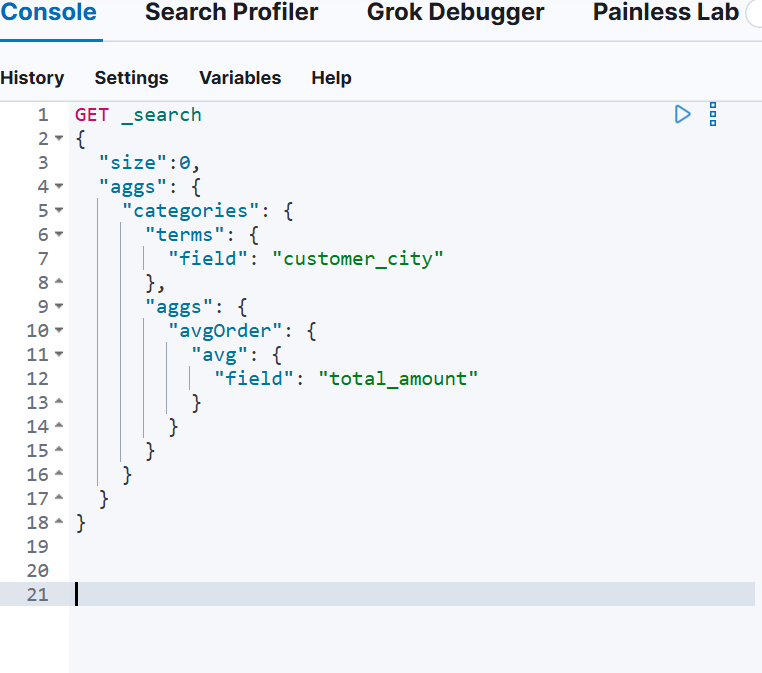
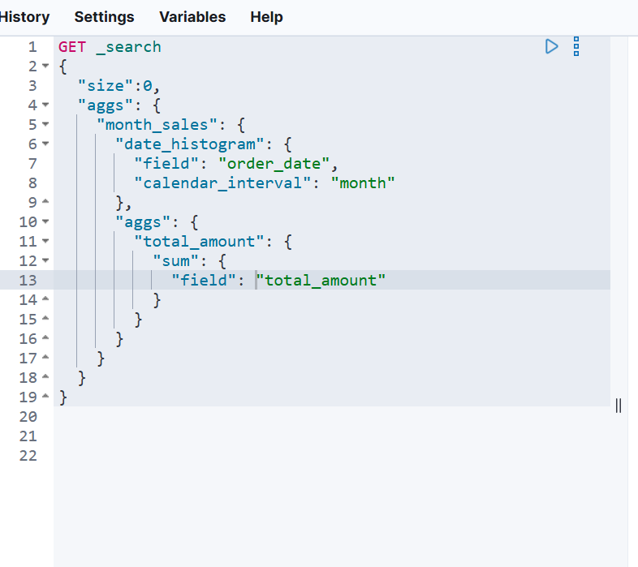
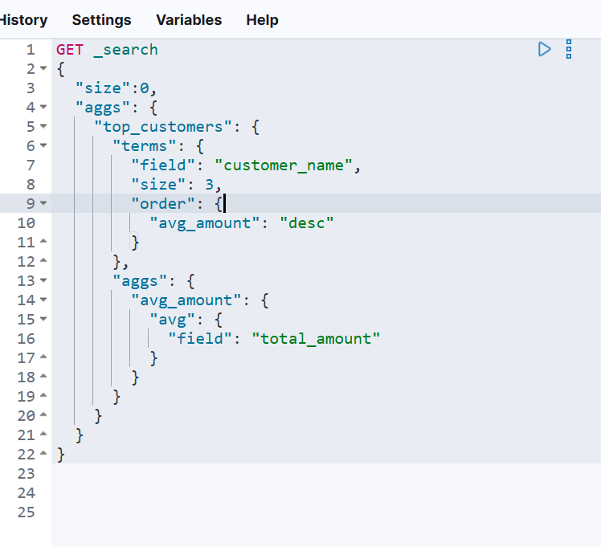

# 实验三 聚合操作练习

>学院：省级示范性软件学院
>
>课程：高级数据库技术与应用
>
>题目：《 实验三：聚合操作练习》
>姓名：满家荣
>学号：2200770216
>班级：软工2205
>日期：2024-10-12
>实验环境： postman

## 一、实验内容

 

- Elasticsearch 聚合操作练习

 

## 二、问题及解决办法

**题目：**

1. **统计每个产品类别的总销售额**。

   

   **结果：**

   ~~~json
   {
       "took": 14,
       "timed_out": false,
       "_shards": {
           "total": 1,
           "successful": 1,
           "skipped": 0,
           "failed": 0
       },
       "hits": {
           "total": {
               "value": 100,
               "relation": "eq"
           },
           "max_score": 1.0,
           "hits": [
               {
                   "_index": "ecommerce",
                   "_id": "1",
                   "_score": 1.0,
                   "_source": {
                       "order_id": "6945",
                       "order_date": "2023-03-06",
                       "customer_id": "C242",
                       "customer_name": "Bob Smith",
                       "customer_gender": "female",
                       "customer_age": 60,
                       "customer_city": "Philadelphia",
                       "product_id": "P041",
                       "product_name": "Pro Accessory",
                       "product_category": "Sports",
                       "quantity": 4,
                       "price": 205.89,
                       "total_amount": 823.56,
                       "payment_method": "Credit Card",
                       "is_returned": false
                   }
               },
               {
                   "_index": "ecommerce",
                   "_id": "2",
                   "_score": 1.0,
                   "_source": {
                       "order_id": "5629",
                       "order_date": "2023-11-14",
                       "customer_id": "C262",
                       "customer_name": "Frank Garcia",
                       "customer_gender": "female",
                       "customer_age": 52,
                       "customer_city": "Dallas",
                       "product_id": "P097",
                       "product_name": "Ultra Accessory",
                       "product_category": "Sports",
                       "quantity": 3,
                       "price": 475.18,
                       "total_amount": 1425.54,
                       "payment_method": "Debit Card",
                       "is_returned": true
                   }
               },
               {
                   "_index": "ecommerce",
                   "_id": "3",
                   "_score": 1.0,
                   "_source": {
                       "order_id": "4488",
                       "order_date": "2023-03-28",
                       "customer_id": "C342",
                       "customer_name": "Frank Garcia",
                       "customer_gender": "female",
                       "customer_age": 62,
                       "customer_city": "New York",
                       "product_id": "P001",
                       "product_name": "Ultra Device",
                       "product_category": "Books",
                       "quantity": 5,
                       "price": 722.89,
                       "total_amount": 3614.45,
                       "payment_method": "Credit Card",
                       "is_returned": false
                   }
               },
               {
                   "_index": "ecommerce",
                   "_id": "4",
                   "_score": 1.0,
                   "_source": {
                       "order_id": "7960",
                       "order_date": "2023-09-23",
                       "customer_id": "C408",
                       "customer_name": "Eva Johnson",
                       "customer_gender": "male",
                       "customer_age": 37,
                       "customer_city": "San Antonio",
                       "product_id": "P079",
                       "product_name": "Ultra Accessory",
                       "product_category": "Home Appliances",
                       "quantity": 2,
                       "price": 485.3,
                       "total_amount": 970.6,
                       "payment_method": "Cash on Delivery",
                       "is_returned": false
                   }
               },
               {
                   "_index": "ecommerce",
                   "_id": "5",
                   "_score": 1.0,
                   "_source": {
                       "order_id": "2111",
                       "order_date": "2023-02-18",
                       "customer_id": "C981",
                       "customer_name": "Eva Garcia",
                       "customer_gender": "female",
                       "customer_age": 19,
                       "customer_city": "Los Angeles",
                       "product_id": "P091",
                       "product_name": "Mega Widget",
                       "product_category": "Books",
                       "quantity": 5,
                       "price": 61.52,
                       "total_amount": 307.6,
                       "payment_method": "Debit Card",
                       "is_returned": false
                   }
               },
               {
                   "_index": "ecommerce",
                   "_id": "6",
                   "_score": 1.0,
                   "_source": {
                       "order_id": "2121",
                       "order_date": "2023-01-10",
                       "customer_id": "C030",
                       "customer_name": "Jack Davis",
                       "customer_gender": "male",
                       "customer_age": 18,
                       "customer_city": "Chicago",
                       "product_id": "P070",
                       "product_name": "Ultra Tool",
                       "product_category": "Home Appliances",
                       "quantity": 3,
                       "price": 860.58,
                       "total_amount": 2581.74,
                       "payment_method": "Debit Card",
                       "is_returned": true
                   }
               },
               {
                   "_index": "ecommerce",
                   "_id": "7",
                   "_score": 1.0,
                   "_source": {
                       "order_id": "1211",
                       "order_date": "2023-07-06",
                       "customer_id": "C672",
                       "customer_name": "Jack Williams",
                       "customer_gender": "female",
                       "customer_age": 64,
                       "customer_city": "San Diego",
                       "product_id": "P092",
                       "product_name": "Mega Device",
                       "product_category": "Electronics",
                       "quantity": 4,
                       "price": 389.1,
                       "total_amount": 1556.4,
                       "payment_method": "Cash on Delivery",
                       "is_returned": true
                   }
               },
               {
                   "_index": "ecommerce",
                   "_id": "8",
                   "_score": 1.0,
                   "_source": {
                       "order_id": "7394",
                       "order_date": "2023-08-15",
                       "customer_id": "C719",
                       "customer_name": "Frank Rodriguez",
                       "customer_gender": "female",
                       "customer_age": 59,
                       "customer_city": "San Diego",
                       "product_id": "P083",
                       "product_name": "Super Device",
                       "product_category": "Beauty",
                       "quantity": 2,
                       "price": 593.15,
                       "total_amount": 1186.3,
                       "payment_method": "Credit Card",
                       "is_returned": true
                   }
               },
               {
                   "_index": "ecommerce",
                   "_id": "9",
                   "_score": 1.0,
                   "_source": {
                       "order_id": "7593",
                       "order_date": "2023-07-22",
                       "customer_id": "C145",
                       "customer_name": "Bob Johnson",
                       "customer_gender": "female",
                       "customer_age": 33,
                       "customer_city": "Dallas",
                       "product_id": "P031",
                       "product_name": "Pro Tool",
                       "product_category": "Furniture",
                       "quantity": 3,
                       "price": 740.32,
                       "total_amount": 2220.96,
                       "payment_method": "PayPal",
                       "is_returned": false
                   }
               },
               {
                   "_index": "ecommerce",
                   "_id": "10",
                   "_score": 1.0,
                   "_source": {
                       "order_id": "3304",
                       "order_date": "2023-03-03",
                       "customer_id": "C111",
                       "customer_name": "Jack Jones",
                       "customer_gender": "female",
                       "customer_age": 53,
                       "customer_city": "Chicago",
                       "product_id": "P027",
                       "product_name": "Elite Device",
                       "product_category": "Jewelry",
                       "quantity": 1,
                       "price": 489.24,
                       "total_amount": 489.24,
                       "payment_method": "Credit Card",
                       "is_returned": true
                   }
               }
           ]
       },
       "aggregations": {
           "categories": {
               "doc_count_error_upper_bound": 0,
               "sum_other_doc_count": 0,
               "buckets": [
                   {
                       "key": "Jewelry",
                       "doc_count": 14,
                       "sumGMV": {
                           "value": 17477.37028503418
                       }
                   },
                   {
                       "key": "Electronics",
                       "doc_count": 13,
                       "sumGMV": {
                           "value": 18941.559997558594
                       }
                   },
                   {
                       "key": "Home Appliances",
                       "doc_count": 13,
                       "sumGMV": {
                           "value": 25865.190231323242
                       }
                   },
                   {
                       "key": "Beauty",
                       "doc_count": 11,
                       "sumGMV": {
                           "value": 22708.94012451172
                       }
                   },
                   {
                       "key": "Furniture",
                       "doc_count": 10,
                       "sumGMV": {
                           "value": 17228.31996154785
                       }
                   },
                   {
                       "key": "Books",
                       "doc_count": 9,
                       "sumGMV": {
                           "value": 11878.820098876953
                       }
                   },
                   {
                       "key": "Groceries",
                       "doc_count": 9,
                       "sumGMV": {
                           "value": 16172.980072021484
                       }
                   },
                   {
                       "key": "Fashion",
                       "doc_count": 8,
                       "sumGMV": {
                           "value": 7073.110048294067
                       }
                   },
                   {
                       "key": "Toys",
                       "doc_count": 7,
                       "sumGMV": {
                           "value": 10528.830047607422
                       }
                   },
                   {
                       "key": "Sports",
                       "doc_count": 6,
                       "sumGMV": {
                           "value": 13250.500122070312
                       }
                   }
               ]
           }
       }
   }
   ~~~

   

2. **计算每个城市的平均订单金额。**

**结果：**

~~~json
{
    "took": 9,
    "timed_out": false,
    "_shards": {
        "total": 1,
        "successful": 1,
        "skipped": 0,
        "failed": 0
    },
    "hits": {
        "total": {
            "value": 100,
            "relation": "eq"
        },
        "max_score": 1.0,
        "hits": [
            {
                "_index": "ecommerce",
                "_id": "1",
                "_score": 1.0,
                "_source": {
                    "order_id": "6945",
                    "order_date": "2023-03-06",
                    "customer_id": "C242",
                    "customer_name": "Bob Smith",
                    "customer_gender": "female",
                    "customer_age": 60,
                    "customer_city": "Philadelphia",
                    "product_id": "P041",
                    "product_name": "Pro Accessory",
                    "product_category": "Sports",
                    "quantity": 4,
                    "price": 205.89,
                    "total_amount": 823.56,
                    "payment_method": "Credit Card",
                    "is_returned": false
                }
            },
            {
                "_index": "ecommerce",
                "_id": "2",
                "_score": 1.0,
                "_source": {
                    "order_id": "5629",
                    "order_date": "2023-11-14",
                    "customer_id": "C262",
                    "customer_name": "Frank Garcia",
                    "customer_gender": "female",
                    "customer_age": 52,
                    "customer_city": "Dallas",
                    "product_id": "P097",
                    "product_name": "Ultra Accessory",
                    "product_category": "Sports",
                    "quantity": 3,
                    "price": 475.18,
                    "total_amount": 1425.54,
                    "payment_method": "Debit Card",
                    "is_returned": true
                }
            },
            {
                "_index": "ecommerce",
                "_id": "3",
                "_score": 1.0,
                "_source": {
                    "order_id": "4488",
                    "order_date": "2023-03-28",
                    "customer_id": "C342",
                    "customer_name": "Frank Garcia",
                    "customer_gender": "female",
                    "customer_age": 62,
                    "customer_city": "New York",
                    "product_id": "P001",
                    "product_name": "Ultra Device",
                    "product_category": "Books",
                    "quantity": 5,
                    "price": 722.89,
                    "total_amount": 3614.45,
                    "payment_method": "Credit Card",
                    "is_returned": false
                }
            },
            {
                "_index": "ecommerce",
                "_id": "4",
                "_score": 1.0,
                "_source": {
                    "order_id": "7960",
                    "order_date": "2023-09-23",
                    "customer_id": "C408",
                    "customer_name": "Eva Johnson",
                    "customer_gender": "male",
                    "customer_age": 37,
                    "customer_city": "San Antonio",
                    "product_id": "P079",
                    "product_name": "Ultra Accessory",
                    "product_category": "Home Appliances",
                    "quantity": 2,
                    "price": 485.3,
                    "total_amount": 970.6,
                    "payment_method": "Cash on Delivery",
                    "is_returned": false
                }
            },
            {
                "_index": "ecommerce",
                "_id": "5",
                "_score": 1.0,
                "_source": {
                    "order_id": "2111",
                    "order_date": "2023-02-18",
                    "customer_id": "C981",
                    "customer_name": "Eva Garcia",
                    "customer_gender": "female",
                    "customer_age": 19,
                    "customer_city": "Los Angeles",
                    "product_id": "P091",
                    "product_name": "Mega Widget",
                    "product_category": "Books",
                    "quantity": 5,
                    "price": 61.52,
                    "total_amount": 307.6,
                    "payment_method": "Debit Card",
                    "is_returned": false
                }
            },
            {
                "_index": "ecommerce",
                "_id": "6",
                "_score": 1.0,
                "_source": {
                    "order_id": "2121",
                    "order_date": "2023-01-10",
                    "customer_id": "C030",
                    "customer_name": "Jack Davis",
                    "customer_gender": "male",
                    "customer_age": 18,
                    "customer_city": "Chicago",
                    "product_id": "P070",
                    "product_name": "Ultra Tool",
                    "product_category": "Home Appliances",
                    "quantity": 3,
                    "price": 860.58,
                    "total_amount": 2581.74,
                    "payment_method": "Debit Card",
                    "is_returned": true
                }
            },
            {
                "_index": "ecommerce",
                "_id": "7",
                "_score": 1.0,
                "_source": {
                    "order_id": "1211",
                    "order_date": "2023-07-06",
                    "customer_id": "C672",
                    "customer_name": "Jack Williams",
                    "customer_gender": "female",
                    "customer_age": 64,
                    "customer_city": "San Diego",
                    "product_id": "P092",
                    "product_name": "Mega Device",
                    "product_category": "Electronics",
                    "quantity": 4,
                    "price": 389.1,
                    "total_amount": 1556.4,
                    "payment_method": "Cash on Delivery",
                    "is_returned": true
                }
            },
            {
                "_index": "ecommerce",
                "_id": "8",
                "_score": 1.0,
                "_source": {
                    "order_id": "7394",
                    "order_date": "2023-08-15",
                    "customer_id": "C719",
                    "customer_name": "Frank Rodriguez",
                    "customer_gender": "female",
                    "customer_age": 59,
                    "customer_city": "San Diego",
                    "product_id": "P083",
                    "product_name": "Super Device",
                    "product_category": "Beauty",
                    "quantity": 2,
                    "price": 593.15,
                    "total_amount": 1186.3,
                    "payment_method": "Credit Card",
                    "is_returned": true
                }
            },
            {
                "_index": "ecommerce",
                "_id": "9",
                "_score": 1.0,
                "_source": {
                    "order_id": "7593",
                    "order_date": "2023-07-22",
                    "customer_id": "C145",
                    "customer_name": "Bob Johnson",
                    "customer_gender": "female",
                    "customer_age": 33,
                    "customer_city": "Dallas",
                    "product_id": "P031",
                    "product_name": "Pro Tool",
                    "product_category": "Furniture",
                    "quantity": 3,
                    "price": 740.32,
                    "total_amount": 2220.96,
                    "payment_method": "PayPal",
                    "is_returned": false
                }
            },
            {
                "_index": "ecommerce",
                "_id": "10",
                "_score": 1.0,
                "_source": {
                    "order_id": "3304",
                    "order_date": "2023-03-03",
                    "customer_id": "C111",
                    "customer_name": "Jack Jones",
                    "customer_gender": "female",
                    "customer_age": 53,
                    "customer_city": "Chicago",
                    "product_id": "P027",
                    "product_name": "Elite Device",
                    "product_category": "Jewelry",
                    "quantity": 1,
                    "price": 489.24,
                    "total_amount": 489.24,
                    "payment_method": "Credit Card",
                    "is_returned": true
                }
            }
        ]
    },
    "aggregations": {
        "categories": {
            "doc_count_error_upper_bound": 0,
            "sum_other_doc_count": 0,
            "buckets": [
                {
                    "key": "Los Angeles",
                    "doc_count": 13,
                    "avgOrder": {
                        "value": 1482.7977142333984
                    }
                },
                {
                    "key": "San Diego",
                    "doc_count": 13,
                    "avgOrder": {
                        "value": 1878.4761915940505
                    }
                },
                {
                    "key": "San Jose",
                    "doc_count": 12,
                    "avgOrder": {
                        "value": 1587.2216771443684
                    }
                },
                {
                    "key": "Philadelphia",
                    "doc_count": 11,
                    "avgOrder": {
                        "value": 1370.19365345348
                    }
                },
                {
                    "key": "New York",
                    "doc_count": 10,
                    "avgOrder": {
                        "value": 1801.9510040283203
                    }
                },
                {
                    "key": "Chicago",
                    "doc_count": 9,
                    "avgOrder": {
                        "value": 1062.1610989040798
                    }
                },
                {
                    "key": "Houston",
                    "doc_count": 9,
                    "avgOrder": {
                        "value": 1735.199978298611
                    }
                },
                {
                    "key": "Dallas",
                    "doc_count": 8,
                    "avgOrder": {
                        "value": 1291.8024978637695
                    }
                },
                {
                    "key": "Phoenix",
                    "doc_count": 8,
                    "avgOrder": {
                        "value": 2315.7625274658203
                    }
                },
                {
                    "key": "San Antonio",
                    "doc_count": 7,
                    "avgOrder": {
                        "value": 1607.7128516605922
                    }
                }
            ]
        }
    }
}
~~~

   3.**找出销量最高的前5个产品。**

**结果：**

~~~json
{
    "took": 30,
    "timed_out": false,
    "_shards": {
        "total": 1,
        "successful": 1,
        "skipped": 0,
        "failed": 0
    },
    "hits": {
        "total": {
            "value": 100,
            "relation": "eq"
        },
        "max_score": null,
        "hits": []
    },
    "aggregations": {
        "top_products": {
            "doc_count_error_upper_bound": -1,
            "sum_other_doc_count": 67,
            "buckets": [
                {
                    "key": "Elite Accessory",
                    "doc_count": 6,
                    "total_quantity": {
                        "value": 25.0
                    }
                },
                {
                    "key": "Ultra Device",
                    "doc_count": 7,
                    "total_quantity": {
                        "value": 24.0
                    }
                },
                {
                    "key": "Ultra Accessory",
                    "doc_count": 8,
                    "total_quantity": {
                        "value": 22.0
                    }
                },
                {
                    "key": "Ultra Gadget",
                    "doc_count": 6,
                    "total_quantity": {
                        "value": 21.0
                    }
                },
                {
                    "key": "Ultra Tool",
                    "doc_count": 6,
                    "total_quantity": {
                        "value": 21.0
                    }
                }
            ]
        }
    }
}
~~~

**4.计算男性和女性客户的平均年龄。**

**结果：**

~~~json
{
    "took": 3,
    "timed_out": false,
    "_shards": {
        "total": 1,
        "successful": 1,
        "skipped": 0,
        "failed": 0
    },
    "hits": {
        "total": {
            "value": 100,
            "relation": "eq"
        },
        "max_score": null,
        "hits": []
    },
    "aggregations": {
        "gender": {
            "doc_count_error_upper_bound": 0,
            "sum_other_doc_count": 0,
            "buckets": [
                {
                    "key": "male",
                    "doc_count": 55,
                    "average_age": {
                        "value": 45.61818181818182
                    }
                },
                {
                    "key": "female",
                    "doc_count": 45,
                    "average_age": {
                        "value": 43.888888888888886
                    }
                }
            ]
        }
    }
}
~~~

**5.统计每种支付方式的使用次数和总金额。**

**结果：**

~~~json
{
    "took": 2,
    "timed_out": false,
    "_shards": {
        "total": 1,
        "successful": 1,
        "skipped": 0,
        "failed": 0
    },
    "hits": {
        "total": {
            "value": 100,
            "relation": "eq"
        },
        "max_score": null,
        "hits": []
    },
    "aggregations": {
        "pay_method": {
            "doc_count_error_upper_bound": 0,
            "sum_other_doc_count": 0,
            "buckets": [
                {
                    "key": "Cash on Delivery",
                    "doc_count": 29,
                    "total_at": {
                        "value": 38746.55044555664
                    }
                },
                {
                    "key": "Debit Card",
                    "doc_count": 29,
                    "total_at": {
                        "value": 48975.19040107727
                    }
                },
                {
                    "key": "Credit Card",
                    "doc_count": 22,
                    "total_at": {
                        "value": 36358.470153808594
                    }
                },
                {
                    "key": "PayPal",
                    "doc_count": 20,
                    "total_at": {
                        "value": 37045.40998840332
                    }
                }
            ]
        }
    }
}
~~~

   **6.计算每月的总销售额。**

**结果：**

~~~json
{
    "took": 51,
    "timed_out": false,
    "_shards": {
        "total": 1,
        "successful": 1,
        "skipped": 0,
        "failed": 0
    },
    "hits": {
        "total": {
            "value": 100,
            "relation": "eq"
        },
        "max_score": null,
        "hits": []
    },
    "aggregations": {
        "month_sales": {
            "buckets": [
                {
                    "key_as_string": "2023-01-01T00:00:00.000Z",
                    "key": 1672531200000,
                    "doc_count": 12,
                    "total_amount": {
                        "value": 24381.61993408203
                    }
                },
                {
                    "key_as_string": "2023-02-01T00:00:00.000Z",
                    "key": 1675209600000,
                    "doc_count": 11,
                    "total_amount": {
                        "value": 18870.850006103516
                    }
                },
                {
                    "key_as_string": "2023-03-01T00:00:00.000Z",
                    "key": 1677628800000,
                    "doc_count": 10,
                    "total_amount": {
                        "value": 17959.33026123047
                    }
                },
                {
                    "key_as_string": "2023-04-01T00:00:00.000Z",
                    "key": 1680307200000,
                    "doc_count": 9,
                    "total_amount": {
                        "value": 18775.959869384766
                    }
                },
                {
                    "key_as_string": "2023-05-01T00:00:00.000Z",
                    "key": 1682899200000,
                    "doc_count": 10,
                    "total_amount": {
                        "value": 11713.169967651367
                    }
                },
                {
                    "key_as_string": "2023-06-01T00:00:00.000Z",
                    "key": 1685577600000,
                    "doc_count": 9,
                    "total_amount": {
                        "value": 6771.1600341796875
                    }
                },
                {
                    "key_as_string": "2023-07-01T00:00:00.000Z",
                    "key": 1688169600000,
                    "doc_count": 7,
                    "total_amount": {
                        "value": 9110.010131835938
                    }
                },
                {
                    "key_as_string": "2023-08-01T00:00:00.000Z",
                    "key": 1690848000000,
                    "doc_count": 8,
                    "total_amount": {
                        "value": 12135.870210647583
                    }
                },
                {
                    "key_as_string": "2023-09-01T00:00:00.000Z",
                    "key": 1693526400000,
                    "doc_count": 3,
                    "total_amount": {
                        "value": 8615.500122070312
                    }
                },
                {
                    "key_as_string": "2023-10-01T00:00:00.000Z",
                    "key": 1696118400000,
                    "doc_count": 6,
                    "total_amount": {
                        "value": 12106.000183105469
                    }
                },
                {
                    "key_as_string": "2023-11-01T00:00:00.000Z",
                    "key": 1698796800000,
                    "doc_count": 6,
                    "total_amount": {
                        "value": 8176.529968261719
                    }
                },
                {
                    "key_as_string": "2023-12-01T00:00:00.000Z",
                    "key": 1701388800000,
                    "doc_count": 9,
                    "total_amount": {
                        "value": 12509.620300292969
                    }
                }
            ]
        }
    }
}
~~~

   **7.找出平均订单金额最高的前3个客户。**

**结果：**

~~~json
{
    "took": 13,
    "timed_out": false,
    "_shards": {
        "total": 1,
        "successful": 1,
        "skipped": 0,
        "failed": 0
    },
    "hits": {
        "total": {
            "value": 100,
            "relation": "eq"
        },
        "max_score": null,
        "hits": []
    },
    "aggregations": {
        "top_products": {
            "doc_count_error_upper_bound": -1,
            "sum_other_doc_count": 87,
            "buckets": [
                {
                    "key": "Elite Accessory",
                    "doc_count": 6,
                    "avg_amount": {
                        "value": 2931.7950032552085
                    }
                },
                {
                    "key": "Super Gadget",
                    "doc_count": 3,
                    "avg_amount": {
                        "value": 2523.2800903320312
                    }
                },
                {
                    "key": "Super Widget",
                    "doc_count": 4,
                    "avg_amount": {
                        "value": 2287.2525329589844
                    }
                }
            ]
        }
    }
}
~~~

   **8.计算每个年龄段（18-30，31-50，51+）的客户数量。**

~~~json
{
    "took": 4,
    "timed_out": false,
    "_shards": {
        "total": 1,
        "successful": 1,
        "skipped": 0,
        "failed": 0
    },
    "hits": {
        "total": {
            "value": 100,
            "relation": "eq"
        },
        "max_score": null,
        "hits": []
    },
    "aggregations": {
        "age_ranges": {
            "buckets": [
                {
                    "key": "18.0-30.0",
                    "from": 18.0,
                    "to": 30.0,
                    "doc_count": 24
                },
                {
                    "key": "31.0-50.0",
                    "from": 31.0,
                    "to": 50.0,
                    "doc_count": 31
                },
                {
                    "key": "51.0-*",
                    "from": 51.0,
                    "doc_count": 42
                }
            ]
        }
    }
}
~~~

   9.**计算每个产品类别的平均单价。**

   10.**找出订单数量最多的前5个城市。**

~~~json
{
    "took": 58,
    "timed_out": false,
    "_shards": {
        "total": 1,
        "successful": 1,
        "skipped": 0,
        "failed": 0
    },
    "hits": {
        "total": {
            "value": 100,
            "relation": "eq"
        },
        "max_score": null,
        "hits": []
    },
    "aggregations": {
        "top_cities": {
            "doc_count_error_upper_bound": 0,
            "sum_other_doc_count": 42,
            "buckets": [
                {
                    "key": "San Jose",
                    "doc_count": 12,
                    "sum_quantity": {
                        "value": 48.0
                    }
                },
                {
                    "key": "Los Angeles",
                    "doc_count": 13,
                    "sum_quantity": {
                        "value": 39.0
                    }
                },
                {
                    "key": "San Diego",
                    "doc_count": 13,
                    "sum_quantity": {
                        "value": 38.0
                    }
                },
                {
                    "key": "Philadelphia",
                    "doc_count": 11,
                    "sum_quantity": {
                        "value": 30.0
                    }
                },
                {
                    "key": "Chicago",
                    "doc_count": 9,
                    "sum_quantity": {
                        "value": 29.0
                    }
                }
            ]
        }
    }
}
~~~

   11.**计算每个季度的平均订单金额。**

~~~json
{
    "took": 48,
    "timed_out": false,
    "_shards": {
        "total": 1,
        "successful": 1,
        "skipped": 0,
        "failed": 0
    },
    "hits": {
        "total": {
            "value": 100,
            "relation": "eq"
        },
        "max_score": null,
        "hits": []
    },
    "aggregations": {
        "quarter_sales": {
            "buckets": [
                {
                    "key_as_string": "2023-01-01T00:00:00.000Z",
                    "key": 1672531200000,
                    "doc_count": 33,
                    "avg_amount": {
                        "value": 1854.9030364065459
                    }
                },
                {
                    "key_as_string": "2023-04-01T00:00:00.000Z",
                    "key": 1680307200000,
                    "doc_count": 28,
                    "avg_amount": {
                        "value": 1330.724638257708
                    }
                },
                {
                    "key_as_string": "2023-07-01T00:00:00.000Z",
                    "key": 1688169600000,
                    "doc_count": 18,
                    "avg_amount": {
                        "value": 1658.9655813641018
                    }
                },
                {
                    "key_as_string": "2023-10-01T00:00:00.000Z",
                    "key": 1696118400000,
                    "doc_count": 21,
                    "avg_amount": {
                        "value": 1561.530973888579
                    }
                }
            ]
        }
    }
}
~~~

   12.**统计每个产品类别中的商品数量。**

~~~json
{
    "took": 4,
    "timed_out": false,
    "_shards": {
        "total": 1,
        "successful": 1,
        "skipped": 0,
        "failed": 0
    },
    "hits": {
        "total": {
            "value": 100,
            "relation": "eq"
        },
        "max_score": null,
        "hits": []
    },
    "aggregations": {
        "category": {
            "doc_count_error_upper_bound": 0,
            "sum_other_doc_count": 0,
            "buckets": [
                {
                    "key": "Jewelry",
                    "doc_count": 14,
                    "sum_count": {
                        "value": 31.0
                    }
                },
                {
                    "key": "Electronics",
                    "doc_count": 13,
                    "sum_count": {
                        "value": 39.0
                    }
                },
                {
                    "key": "Home Appliances",
                    "doc_count": 13,
                    "sum_count": {
                        "value": 40.0
                    }
                },
                {
                    "key": "Beauty",
                    "doc_count": 11,
                    "sum_count": {
                        "value": 31.0
                    }
                },
                {
                    "key": "Furniture",
                    "doc_count": 10,
                    "sum_count": {
                        "value": 32.0
                    }
                },
                {
                    "key": "Books",
                    "doc_count": 9,
                    "sum_count": {
                        "value": 23.0
                    }
                },
                {
                    "key": "Groceries",
                    "doc_count": 9,
                    "sum_count": {
                        "value": 30.0
                    }
                },
                {
                    "key": "Fashion",
                    "doc_count": 8,
                    "sum_count": {
                        "value": 23.0
                    }
                },
                {
                    "key": "Toys",
                    "doc_count": 7,
                    "sum_count": {
                        "value": 22.0
                    }
                },
                {
                    "key": "Sports",
                    "doc_count": 6,
                    "sum_count": {
                        "value": 26.0
                    }
                }
            ]
        }
    }
}
~~~

   13.**计算男性和女性客户的平均订单金额。**

~~~json
{
    "took": 15,
    "timed_out": false,
    "_shards": {
        "total": 1,
        "successful": 1,
        "skipped": 0,
        "failed": 0
    },
    "hits": {
        "total": {
            "value": 100,
            "relation": "eq"
        },
        "max_score": null,
        "hits": []
    },
    "aggregations": {
        "gender": {
            "doc_count_error_upper_bound": 0,
            "sum_other_doc_count": 0,
            "buckets": [
                {
                    "key": "male",
                    "doc_count": 55,
                    "avg_total_amount": {
                        "value": 1798.5043728915127
                    }
                },
                {
                    "key": "female",
                    "doc_count": 45,
                    "avg_total_amount": {
                        "value": 1382.397343995836
                    }
                }
            ]
        }
    }
}
~~~

   14.**找出总销售额最高的前10个日期。**

~~~json
{
    "took": 39,
    "timed_out": false,
    "_shards": {
        "total": 1,
        "successful": 1,
        "skipped": 0,
        "failed": 0
    },
    "hits": {
        "total": {
            "value": 100,
            "relation": "eq"
        },
        "max_score": null,
        "hits": []
    },
    "aggregations": {
        "top_date": {
            "doc_count_error_upper_bound": -1,
            "sum_other_doc_count": 86,
            "buckets": [
                {
                    "key": 1682726400000,
                    "key_as_string": "2023-04-29T00:00:00.000Z",
                    "doc_count": 2,
                    "sum_total_amount": {
                        "value": 5951.77001953125
                    }
                },
                {
                    "key": 1677628800000,
                    "key_as_string": "2023-03-01T00:00:00.000Z",
                    "doc_count": 2,
                    "sum_total_amount": {
                        "value": 5457.640075683594
                    }
                },
                {
                    "key": 1703980800000,
                    "key_as_string": "2023-12-31T00:00:00.000Z",
                    "doc_count": 2,
                    "sum_total_amount": {
                        "value": 5177.3402099609375
                    }
                },
                {
                    "key": 1694736000000,
                    "key_as_string": "2023-09-15T00:00:00.000Z",
                    "doc_count": 1,
                    "sum_total_amount": {
                        "value": 4886.10009765625
                    }
                },
                {
                    "key": 1696291200000,
                    "key_as_string": "2023-10-03T00:00:00.000Z",
                    "doc_count": 1,
                    "sum_total_amount": {
                        "value": 4858.9501953125
                    }
                },
                {
                    "key": 1678665600000,
                    "key_as_string": "2023-03-13T00:00:00.000Z",
                    "doc_count": 1,
                    "sum_total_amount": {
                        "value": 4592.9501953125
                    }
                },
                {
                    "key": 1691107200000,
                    "key_as_string": "2023-08-04T00:00:00.000Z",
                    "doc_count": 1,
                    "sum_total_amount": {
                        "value": 4131.9501953125
                    }
                },
                {
                    "key": 1677283200000,
                    "key_as_string": "2023-02-25T00:00:00.000Z",
                    "doc_count": 2,
                    "sum_total_amount": {
                        "value": 3872.6699829101562
                    }
                },
                {
                    "key": 1681171200000,
                    "key_as_string": "2023-04-11T00:00:00.000Z",
                    "doc_count": 1,
                    "sum_total_amount": {
                        "value": 3790.89990234375
                    }
                },
                {
                    "key": 1674777600000,
                    "key_as_string": "2023-01-27T00:00:00.000Z",
                    "doc_count": 1,
                    "sum_total_amount": {
                        "value": 3714.25
                    }
                }
            ]
        }
    }
}
~~~

   15.**计算每个季度销售额最高的产品类别。**

~~~json
{
    "took": 11,
    "timed_out": false,
    "_shards": {
        "total": 1,
        "successful": 1,
        "skipped": 0,
        "failed": 0
    },
    "hits": {
        "total": {
            "value": 100,
            "relation": "eq"
        },
        "max_score": null,
        "hits": []
    },
    "aggregations": {
        "quarter_top_category": {
            "buckets": [
                {
                    "key_as_string": "2023-01-01T00:00:00.000Z",
                    "key": 1672531200000,
                    "doc_count": 33,
                    "category": {
                        "doc_count_error_upper_bound": 0,
                        "sum_other_doc_count": 25,
                        "buckets": [
                            {
                                "key": "Jewelry",
                                "doc_count": 8,
                                "sum_total_amount": {
                                    "value": 11757.280212402344
                                }
                            }
                        ]
                    }
                },
                {
                    "key_as_string": "2023-04-01T00:00:00.000Z",
                    "key": 1680307200000,
                    "doc_count": 28,
                    "category": {
                        "doc_count_error_upper_bound": 0,
                        "sum_other_doc_count": 24,
                        "buckets": [
                            {
                                "key": "Home Appliances",
                                "doc_count": 4,
                                "sum_total_amount": {
                                    "value": 6474.219955444336
                                }
                            }
                        ]
                    }
                },
                {
                    "key_as_string": "2023-07-01T00:00:00.000Z",
                    "key": 1688169600000,
                    "doc_count": 18,
                    "category": {
                        "doc_count_error_upper_bound": 0,
                        "sum_other_doc_count": 15,
                        "buckets": [
                            {
                                "key": "Home Appliances",
                                "doc_count": 3,
                                "sum_total_amount": {
                                    "value": 6066.1199951171875
                                }
                            }
                        ]
                    }
                },
                {
                    "key_as_string": "2023-10-01T00:00:00.000Z",
                    "key": 1696118400000,
                    "doc_count": 21,
                    "category": {
                        "doc_count_error_upper_bound": 0,
                        "sum_other_doc_count": 17,
                        "buckets": [
                            {
                                "key": "Beauty",
                                "doc_count": 4,
                                "sum_total_amount": {
                                    "value": 9416.89013671875
                                }
                            }
                        ]
                    }
                }
            ]
        }
    }
}
~~~

